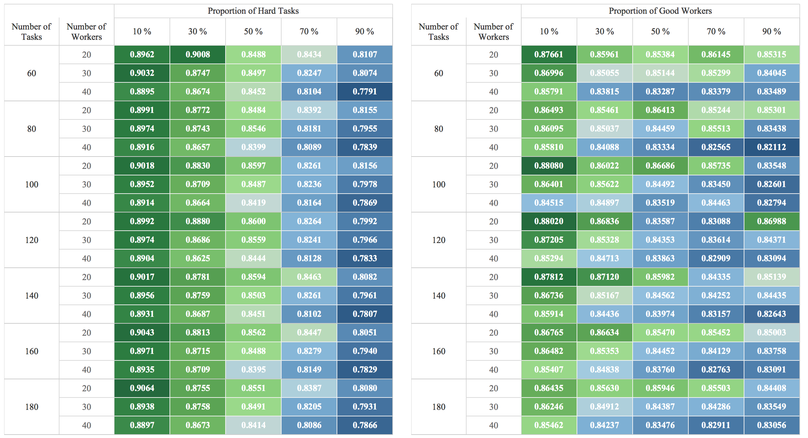
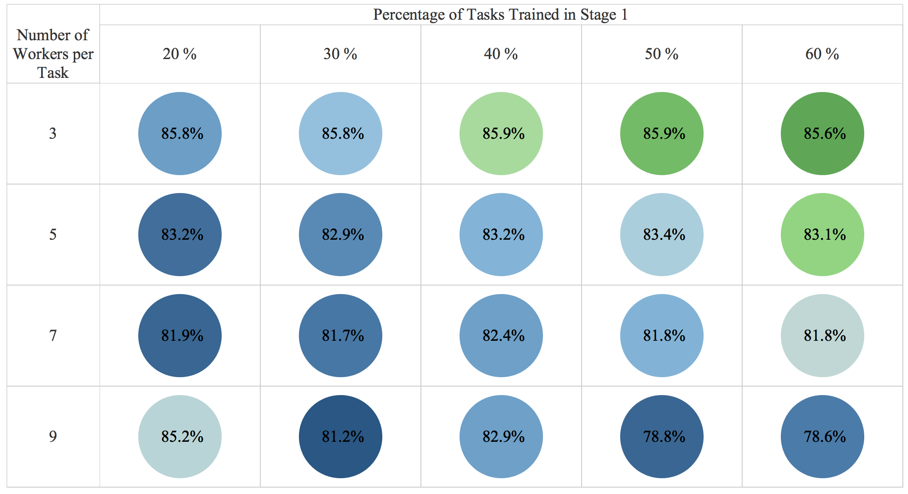
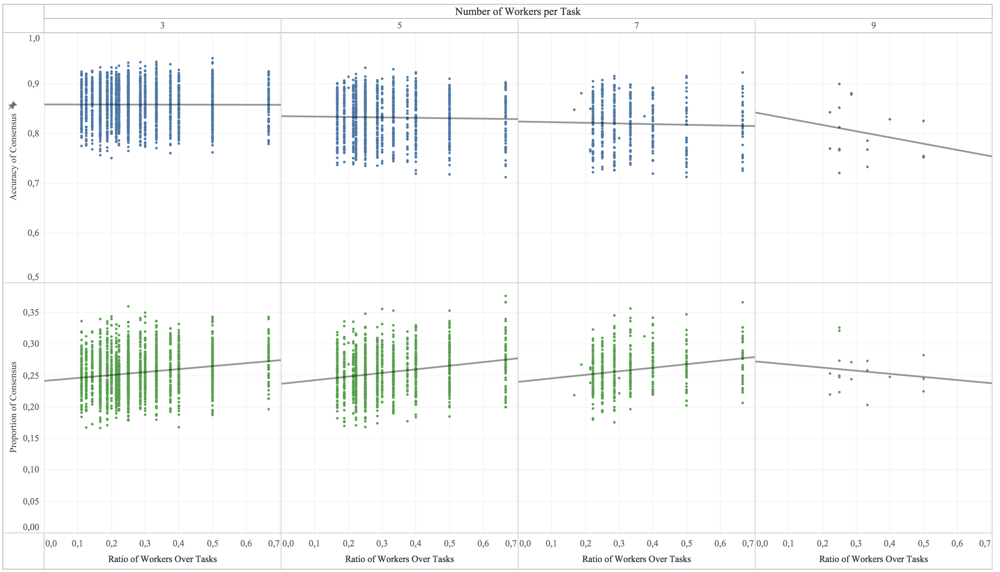

CrowdED: Guideline for designing optimal crowdsourcing experiments
====

[CrowdApp](https://pedrohserrano.shinyapps.io/crowdapp/) Beta

## Usage

1) Clone this repo

        git clone https://github.com/pedrohserrano/crowdED.git
        cd crowdED

2) Install crowdED

        pip install crowdED

## Preliminary Results

## License
